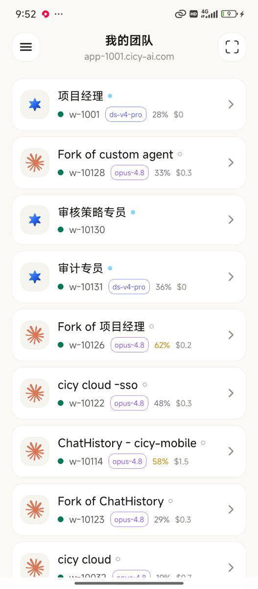

# CiCy Mobile

The mobile client for the **CiCy** agent platform — browse your agents, open an
agent and chat with it, and scan a QR code to join a team. One
[Expo](https://expo.dev) codebase ships three ways:

- **iOS / Android** native apps
- a **web / PWA** static export
- a **Telegram Mini App** (the same web export, hosted on Cloudflare)

## Screenshots




## Download

- **Repo**: <https://github.com/cicy-ai/cicy-mobile>
- **Android APK**: <https://r2.deepfetch.de5.net/cicy-mobile/cicy-latest.apk> — `adb install`, or open the link on the phone.
- **iOS IPA** (unsigned): <https://r2.deepfetch.de5.net/cicy-mobile/cicy-latest.ipa> — re-sign with your own Apple ID via **Sideloadly / AltStore**, or use the [`cicy-mobile-install`](https://github.com/cicy-ai/cicy-skills/tree/main/skills/cicy-mobile-install) skill.
- **Web / Telegram Mini App**: <https://telegram-bot.cicy-ai.com>

## Architecture

The app is a **pure client — it has no backend of its own.** Each team's
`cicy-code` server *is* the backend, reached directly at the HTTPS address
carried in the add-team QR (the server's `CICY_PUBLIC_URL`). The server answers
CORS itself, so the page calls it cross-origin; nothing is proxied and no
backend address or token is ever hardcoded in the client.

- **Platform splits** live in `*.web.tsx` siblings so native is never touched —
  e.g. `TerminalView.tsx` (native WebView) vs `TerminalView.web.tsx` (iframe),
  `app/scan.tsx` (camera) vs `app/scan.web.tsx` (paste form). Animations have
  web variants too (`*.web.tsx`) that use CSS keyframes instead of reanimated,
  to keep the web bundle light.
- **History / chat** (`src/components/HistoryView.tsx`) is a two-part model:
  a committed window (`current.json`) plus an in-flight live tail
  (`reply.json`). Opening an agent paints instantly from a two-tier cache
  (`src/lib/historyCache.ts` — in-memory + persistent) and refreshes in the
  background, so there's no spinner on every open.
- Note: React Native components do **not** use `data-id` (that's a web-only
  convention).

## Develop

```bash
npm install
npx expo start            # dev server (press w / a / i)
```

### Web / PWA

```bash
npx expo export -p web      # static export → dist/
npx expo serve --port 8088  # serve dist/ (handles cleanUrls: /agents → agents.html)
```

### Native

`android/` and `ios/` are generated (git-ignored) — regenerate with prebuild:

```bash
npx expo prebuild -p android         # or -p ios
npx expo run:android                 # build + run on device/emulator
npx expo run:ios
```

iOS installs go through Xcode. See `scripts/push-to-mac.sh` for syncing to a Mac
build host. Never commit Xcode/Gradle-managed files.

## Release

Releases are **tag-driven** via GitHub Actions
([`.github/workflows/deploy.yml`](.github/workflows/deploy.yml)):

```bash
git tag v1.0.1
git push origin v1.0.1
```

A `v*` tag triggers two jobs:

1. **web** — `expo export -p web` → deploys the assets-only Cloudflare Worker
   (`telegram-bot.cicy-ai.com` + `*.workers.dev`), i.e. the **Telegram Mini App
   / PWA**, then verifies the live bundle matches the build.
2. **android** — `expo prebuild` → `gradlew assembleRelease` → attaches the
   APK to a **GitHub Release** for the tag, and mirrors it to the
   **public R2 CDN** (global download, no GitHub auth, works from anywhere):
   - latest: <https://r2.deepfetch.de5.net/cicy-mobile/cicy-latest.apk>
   - versioned: `https://r2.deepfetch.de5.net/cicy-mobile/cicy-<version>.apk`

### iOS (manual)

iOS is **not** on the tag path — the unsigned-IPA build is triggered manually
(macOS runners are slow/expensive). Run the `release` workflow from the Actions
tab (Run workflow → `ios_version`); it builds
an **unsigned IPA** and pushes it to R2 (install via Sideloadly / AltStore, which
re-sign with your Apple ID — free account = 7-day cert):
- latest: <https://r2.deepfetch.de5.net/cicy-mobile/cicy-latest.ipa>
- versioned: `https://r2.deepfetch.de5.net/cicy-mobile/cicy-<version>.ipa`

The version comes from the tag: `v1.0.1` → `app.json` `expo.version = 1.0.1`,
and `android.versionCode` = the workflow run number (monotonic), via
`scripts/sync-version.mjs`.

### Required secrets

Repo → Settings → Secrets and variables → Actions:

| Secret | Used by |
| --- | --- |
| `CLOUDFLARE_API_TOKEN` | web deploy |
| `CLOUDFLARE_ACCOUNT_ID` | web deploy |

### Android signing

The CI APK is signed with the **debug keystore** that `expo prebuild`
generates — installable for sideload / Telegram distribution, but every build
gets a different signature (can't upgrade-in-place, not Play-Store-ready). For a
stable/upgradable signature, add a release keystore and a config plugin that
wires a `release` `signingConfig`, then feed the keystore via a secret in the
`android` job.

## Telegram Mini App

The web build is the `@cicy_ai_bot` menu-button **"CiCy"** target
(`https://telegram-bot.cicy-ai.com`). Inside Telegram the QR scanner uses the
native `showScanQrPopup`; plain browsers fall back to pasting the add-team link.
The Telegram SDK is loaded so it never blocks first paint or the `load` event
(see `app/+html.tsx`).
